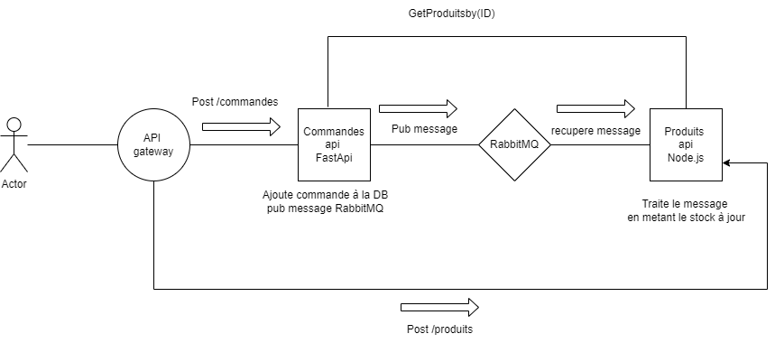

# Microservices E-Commerce – Projet 321

Ce projet met en place une partie d'une plateforme e-commerce en architecture microservices avec les services suivants :

- **Produits API** : service Node.js/Express pour la gestion des produits.
- **Commandes API** : service FastAPI pour la gestion des commandes.
- **RabbitMQ** : gestion des messages asynchrones (mise à jour du stock).
- **Traefik** : reverse proxy API gateway pour pointer vers le bon service.

---

## Vue d'ensemble de l'architecture



## Lancer le projet

### Prérequis

- [Docker](https://www.docker.com/)
- [Docker Compose](https://docs.docker.com/compose/)

dans le folder contenant le `docker-compose.yml` lancer:

```bash
docker compose up --build
```

# Accès aux services

API Produits : http://localhost/api/produits

Swagger Produits : http://localhost/produits/docs/#/

API Commandes : http://localhost/api/commandes

Swagger Commandes : http://localhost/api/commandes/docs

RabbitMQ UI : http://localhost:15672
- Username : user
- Password: password

Traefik UI : http://localhost:8080/dashboard/#/

##  Utilisation de RabbitMQ
#### Pattern choisi : Work Queue

Le service `commandes-api` envoie des messages dans une file RabbitMQ (`stock_update`) pour signaler la création d'une commande avec certains produits. Le service `produits-api` consomme ces messages pour **mettre à jour le stock** des produits concernés.


#### Intérêt de RabbitMQ ici

- **Découplage** : les deux services n’ont pas besoin de se connaître.
- **Fiabilité** : si `produits-api` est temporairement indisponible, les messages restent en file.
- **Scalabilité** : on peut ajouter plusieurs consommateurs.