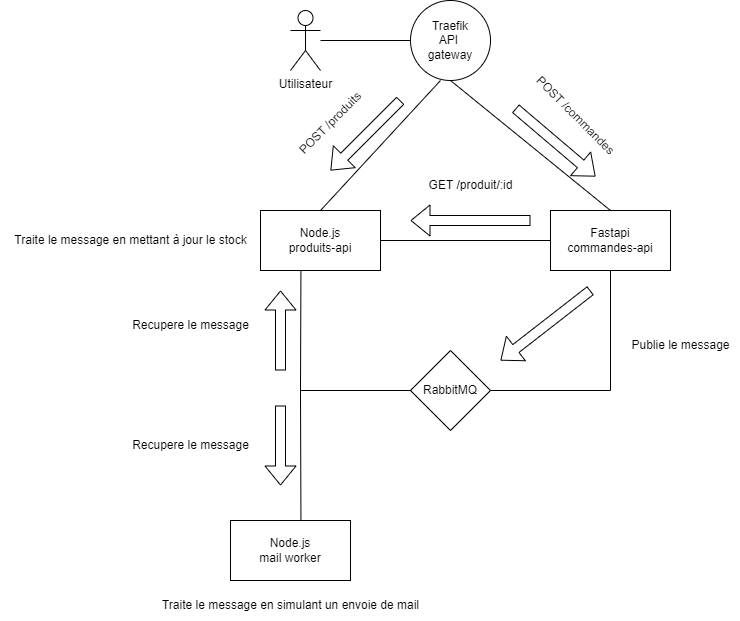

# Microservices E-Commerce – Projet 321

Le projet simule en  une partie d'une architecture e-commerce en architecture microservices et on utilise une messagerie asynchrone via RabbitMQ.

---

## Services inclus
- **Produits API** (`Node.js/Express`) : gestion du catalogue produits et du stock.
- **Commandes API** (`FastAPI`) : création de commandes, calcul total, publication d’événements.
- **RabbitMQ** : broker de messages pour l’échange asynchrone entre services.
- **Mail Worker** (`Node.js`) : consomme les commandes et simule l’envoi d’un e-mail.
- **Traefik** : reverse proxy API Gateway pour centraliser l'accès aux APIs.

---

## Vue d'ensemble de l'architecture



---

## Lancer le projet

### Prérequis

- Docker
- Docker Compose

### Démarrage

Dans le dossier qui contient le fichier `docker-compose.yml` :

```bash
docker compose up --build
```

### Si besoin de réinitialiser complètement :

```bash
docker compose down -v
docker compose up --build
```

---

## Accès aux services

| Service              | URL                                   |
|----------------------|----------------------------------------|
| **API Produits**     | http://localhost/api/produits          |
| **Swagger Produits** | http://localhost/produits/docs/#/      |
| **API Commandes**    | http://localhost/api/commandes         |
| **Swagger Commandes**| http://localhost/api/commandes/docs    |
| **RabbitMQ UI**      | http://localhost:15672                 |
| **Traefik Dashboard**| http://localhost:8080/dashboard/#/     |

**Login RabbitMQ** :
- **Username** : `user`
- **Password** : `password`

---

## Utilisation de RabbitMQ

### Pattern utilisé : `Pub/Sub`

- Le service **commandes-api** publie un message à chaque nouvelle commande dans un **exchange** RabbitMQ.
- Le **produits-api** écoute ce message pour mettre à jour le stock.
- Le **mail-worker** écoute le même message et simule un envoi d’email au client.

Chaque service consomme depuis une **queue different**, liée à l’exchange **commandes**.

---

### Exemple de message publié

```json
{
  "id_commande": 12,
  "email": "client@example.com",
  "total": 129.50,
  "produits": [
    { "produit_id": 1, "quantite": 2 },
    { "produit_id": 4, "quantite": 1 }
  ],
  "timestamp": "2025-05-22T14:34:12.456Z"
}
```

---

### ✅ Avantages du pattern Pub/Sub

- **Découplage total** : chaque service consomme indépendamment le message.
- **Scalabilité** : on peut dupliquer les consommateurs (stock, mail, logs...).
- **Résilience** : les messages sont persistés dans les queues même si un service est temporairement hors-ligne.

## 🧠 Justification de l’usage de RabbitMQ

Vu l’architecture RabbitMQ a été utilisé parce que il permet :

 - Asynchronisme : les APIs répondent immédiatement, sans attendre les traitements lents (stock, mail).

 - Résilience : les messages sont conservés même si un service tombe temporairement.

 - Scalabilité horizontale : on peut multiplier les consommateurs sans changer le producteur.

 - Extensibilité : de nouveaux services peuvent consommer les événements sans perturber le reste du système.

 - Découplage fort : chaque service fait son travail sans connaître les autres.

RabbitMQ est donc essentiele dans cette architecture.


